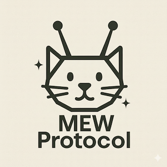

# 🐱 MEW Protocol - Multi-Entity Workspace Protocol 🚀

<div align="center">
  
</div>

MEW Protocol (pronounced like a cat's "mew" 🐾) keeps **humans in the loop** - you participate directly in agent workspaces, see every operation, and maintain control through gateway-enforced capabilities.

## The Problem: Agents Operating in the Dark

```
MCP:  human ──► agent ════► mcp_server
                  ↑
            trust boundary
            (agent decides)

A2A:  human ──► agent₁ ════► agent₂
                  ↑
            trust boundary
            (agent₁ decides)

MEW:  human ──►┌─────────┐◄── agent
               │ GATEWAY │
 mcp_server ──►└─────────┘◄── agent₂
                    ↑
              trust boundary
            (gateway enforces)
```

**Legend:** ──► trusted flow, ════► potentially untrusted

## 🌟 The Solution: Human-in-the-Loop by Design

In MEW, humans aren't observers - they're **active participants** alongside agents and MCP servers:
- 👀 **See everything**: Every message, every operation, nothing hidden
- 🎛️ **Control access**: You grant and revoke capabilities, not the agents
- ✅ **Review proposals**: Agents propose, you decide what executes
- 💬 **Direct interaction**: Chat with any participant, send MCP requests directly

The **proposal mechanism** ensures humans stay in control. New agents start with proposal-only access - they suggest operations but can't execute until you approve. As you observe their behavior, you grant specific capabilities. Trust is earned, not assumed.

## 🎯 Human-Controlled Workflow

1. **You define the rules**: Set initial capabilities for each participant
2. **Agents propose**: Limited agents suggest operations via proposals
3. **You review**: Approve, reject, or delegate review to trusted participants
4. **You grant trust**: Expand capabilities for agents that prove reliable
5. **You maintain control**: Revoke capabilities instantly if needed

## 📦 Current Version

**v0.4** - Released 2025-09-26 🎉

MEW Protocol is in experimental phase (v0.x) with breaking changes allowed between versions. See [spec/protocol/v0.4/SPEC.md](spec/protocol/v0.4/SPEC.md) for the current specification.

## 🚀 Quick Start

### Install

```bash
npm install -g @mew-protocol/mew
```

### Create & Launch a Workspace

```bash
# Create a new directory for your workspace
mkdir my-workspace
cd my-workspace

# Start MEW - it will guide you through setup
mew

# 🐱 MEW Protocol workspace starting...
# 🎯 Setting up your workspace...
# 🤖 Choose your AI agent (Claude, GPT-4, etc.)
# 📁 Select tools (filesystem, web search, etc.)
# 🔐 Configure capabilities (proposals vs direct execution)
#
# Type 'help' for commands or start chatting!
```

That's it! MEW guides you through setting up your workspace with:
- 🧑‍💻 You participating directly via terminal
- 🤖 AI agent(s) with configured capabilities
- 🛠️ Tools and MCP servers for extended functionality
- ✅ Proposal/approval flow for safe operations
- 🎓 Progressive trust as patterns prove safe

## 📚 Documentation

See [docs/README.md](docs/README.md) for complete documentation including:
- 🚀 Getting Started Guide
- 🧪 Testing Guide
- 🏗️ Architecture Overview
- 🤝 Contributing Guidelines

## 📋 Specifications

- [Current Specification (v0.4)](spec/protocol/v0.4/SPEC.md)
- [Draft Specification (next version)](spec/protocol/draft/SPEC.md)
- [Architecture Decision Records](spec/protocol/v0.4/accepted/)
- [Changelog](CHANGELOG.md)

## 🐈 Why "MEW"?

The name playfully evokes "herding cats" 🐈‍⬛🐈🐈‍⬛ - the quintessential challenge of coordinating multiple independent, autonomous agents. MEW Protocol provides the framework to bring order to this chaos, teaching the "cats" to work together effectively in a shared workspace. 🌠
