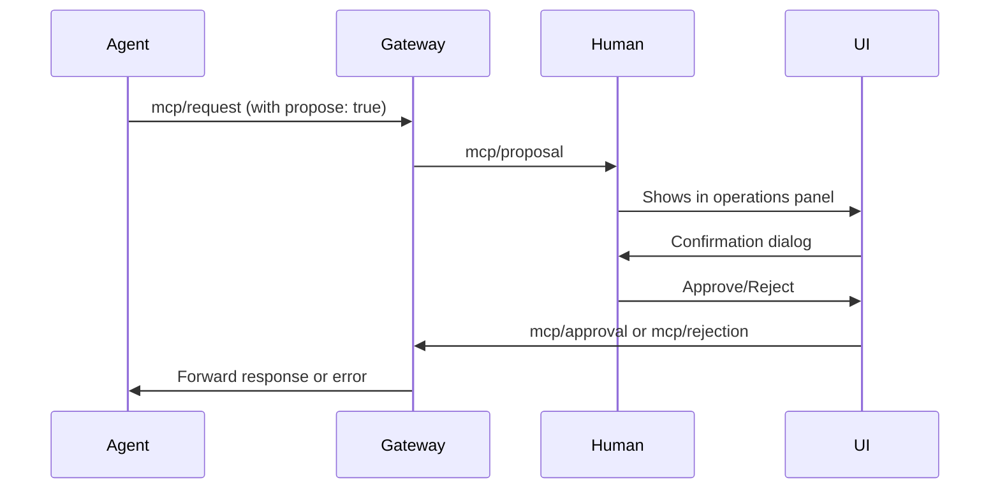

# ADR-007: Advanced Interactive Mode with MCP Confirmations

**Status:** Proposed  
**Date:** 2025-01-10  
**Incorporation:** Not Incorporated

## Context

The MEW protocol enables agents to propose MCP (Model Context Protocol) operations that may have significant effects - running code, modifying files, accessing APIs, etc. Currently, these operations flow through the system without human oversight in automated scenarios.

For interactive sessions, we need a way to:
1. Intercept MCP operation proposals from agents
2. Present them to human participants for review
3. Allow/deny operations before execution
4. Track operation history and outcomes
5. Provide context about what agents are trying to do

This builds on the simple interactive mode (ADR-005) to create a more sophisticated interface suitable for supervised agent collaboration.

## Use Cases

### Primary Use Case: Supervised Agent Operations

```
1. Human asks: "Help me refactor this code"
2. Agent proposes: mcp/request to read file
3. System shows confirmation dialog → Human approves
4. Agent reads file
5. Agent proposes: mcp/request to write modified file
6. System shows diff preview → Human approves/modifies/rejects
7. Operation proceeds or is cancelled
```

### Secondary Use Cases

1. **Audit Trail**: Track all operations attempted and approved/rejected
2. **Learning Mode**: See what tools agents use for different tasks
3. **Safety Gate**: Prevent unintended operations in development
4. **Delegation**: Approve certain operations automatically based on rules

## Options Considered

### Option 1: Inline Confirmations

Show confirmations directly in the chat flow:

```
[10:23:45] ← code-agent mcp/proposal
└─ Wants to: read_file("/src/main.js")

⚠️  Operation requires approval:
Agent: code-agent
Operation: read_file
Path: /src/main.js
[A]pprove / [R]eject / [M]odify? _
```

**Pros:**
- Simple to implement
- Maintains context in chat
- Works with basic terminal

**Cons:**
- Interrupts chat flow
- Can't see chat history while deciding
- Hard to review complex operations

### Option 2: Modal Dialogs

Pop-up modal dialogs over the chat interface:

```
┌─────────────────────────────────────────┐
│         Operation Approval Required      │
├─────────────────────────────────────────┤
│ Agent: code-agent                        │
│ Tool: read_file                          │
│ Arguments:                               │
│   path: /src/main.js                     │
│                                          │
│ Risk Level: Low                          │
│ Description: Read source file content    │
│                                          │
│ [✓] Approve  [✗] Reject  [?] Details    │
└─────────────────────────────────────────┘
```

**Pros:**
- Clear separation from chat
- Can show more details
- Familiar UI pattern

**Cons:**
- Blocks entire interface
- Requires TUI framework
- Can't see context while deciding

### Option 3: Native Scrolling with Persistent Bottom UI (Recommended)

Leverage native terminal scrollback with a persistent bottom interface:

```
[Terminal scrollback area - native scrolling]
[10:23:45] Human: Help me refactor this
[10:23:46] Agent: I'll help you refactor the code. Let me first read the file.
[10:23:47] System: ⚠️ Operation proposed by code-agent: read_file("/src/main.js")
[10:23:48] System: ✓ Approved by human
[10:23:49] Agent: I see the issue. Let me fix it...
[10:23:50] System: ⚠️ Operation proposed by code-agent: write_file("/src/main.js", ...)

────────────────────────────────────────────────────────────────────
│ 🔔 Pending: write_file from code-agent │ [Y]es [N]o [D]iff [?]Help │
├─────────────────────────────────────────────────────────────────────
│ > Fix the import statements_                                       │
├─────────────────────────────────────────────────────────────────────
│ Connected: ✓ │ Agents: 3 │ Pending: 1 │ History: 6 │ Ctrl+C: Exit │
────────────────────────────────────────────────────────────────────
```

**Pros:**
- Native terminal scrolling works perfectly
- Can scroll back through entire history
- Terminal search (Ctrl+R) works
- Copy/paste works naturally
- Persistent UI doesn't interfere with content
- Less intrusive than full TUI

**Cons:**
- Can't show side panels
- Limited space for persistent UI
- Status updates need careful positioning

## Decision

Implement **Option 3: Native Scrolling with Persistent Bottom UI** using the Ink framework as the **default interactive mode**.

The advanced Ink-based interface becomes the default experience, with the simple readline mode (ADR-005) available via `--debug` flag for troubleshooting.

### Command Structure

```bash
# Default - uses advanced Ink UI
mew space connect
mew space up -i

# Debug mode - uses simple readline UI
mew space connect --debug
mew space up -i --debug

# Aliases for clarity
mew space connect --simple  # same as --debug
mew space connect --no-ui    # same as --debug
```

This approach provides the best user experience by default while maintaining the simple mode for debugging protocol issues.

## Implementation Details

### Message Flow



### New Message Types

**Proposal Message:**
```json
{
  "kind": "mcp/proposal",
  "from": "code-agent",
  "payload": {
    "id": "op-123",
    "method": "tools/call",
    "params": {
      "name": "read_file",
      "arguments": {
        "path": "/src/main.js"
      }
    },
    "metadata": {
      "risk_level": "low",
      "description": "Read source file content",
      "estimated_time": "instant"
    }
  }
}
```

**Approval Message:**
```json
{
  "kind": "mcp/approval",
  "to": ["gateway"],
  "payload": {
    "proposal_id": "op-123",
    "approved": true,
    "modified_params": null,
    "conditions": {
      "timeout": 30000,
      "require_result_review": false
    }
  }
}
```

### UI Architecture (Inspired by Gemini CLI)

**Key Principle**: Use Ink's `Static` component for message history (enables native scrolling) while React manages the persistent bottom UI.

**Main App Structure:**
```jsx
import { Static, Box, Text } from 'ink';
import { useState, useRef } from 'react';

const AdvancedInteractiveApp = ({ ws, participant, space }) => {
  const [history, setHistory] = useState([]);
  const [pending, setPending] = useState(null);
  const [inputValue, setInputValue] = useState('');
  const mainControlsRef = useRef();
  
  return (
    <Box flexDirection="column" height="100%">
      {/* Message History - Native Scrolling via Static */}
      <Static items={history}>
        {(item) => (
          <MessageDisplay 
            key={item.id}
            message={item}
            showOperations={item.kind === 'mcp/proposal'}
          />
        )}
      </Static>
      
      {/* Pending/Streaming Content */}
      {pending && (
        <Box flexDirection="column">
          <StreamingMessage message={pending} />
        </Box>
      )}
      
      {/* Persistent Bottom UI */}
      <Box flexDirection="column" ref={mainControlsRef}>
        <OperationNotification operation={pendingOperation} />
        <Composer 
          value={inputValue}
          onChange={setInputValue}
          onSubmit={handleSubmit}
        />
        <StatusBar status={connectionStatus} />
      </Box>
    </Box>
  );
};
```

**Composer Component (Input Area):**
```jsx
const Composer = ({ value, onChange, onSubmit, pendingOp }) => {
  const { terminalWidth } = useTerminalSize();
  
  return (
    <Box flexDirection="column" borderStyle="single" borderColor="dim">
      {/* Operation Confirmation Bar */}
      {pendingOp && (
        <Box paddingX={1} borderBottom="─">
          <Box flexGrow={1}>
            <Text color="yellow">
              ⚠️ {pendingOp.agent} wants to: {pendingOp.tool}
            </Text>
          </Box>
          <Text dim> [Y]es [N]o [D]iff [A]ll </Text>
        </Box>
      )}
      
      {/* Input Field */}
      <Box paddingX={1} paddingY={0.5}>
        <Text color="green">{'> '}</Text>
        <TextInput
          value={value}
          onChange={onChange}
          onSubmit={onSubmit}
          placeholder="Type a message or / for commands..."
        />
      </Box>
      
      {/* Context/Status Line */}
      <Box paddingX={1} borderTop="─">
        <Box flexGrow={1} gap={2}>
          <Text dim>Connected</Text>
          <Text dim>•</Text>
          <Text dim>{pendingOp ? '1 pending' : 'Ready'}</Text>
        </Box>
        <Text dim>Ctrl+S: Show more • Ctrl+C: Exit</Text>
      </Box>
    </Box>
  );
};
```

**Content-Aware Truncation (MaxSizedBox Pattern):**
```jsx
const MaxSizedBox = ({ children, maxHeight, showOverflow }) => {
  const [isOverflowing, setIsOverflowing] = useState(false);
  const contentRef = useRef();
  
  // Measure content and truncate if needed
  useEffect(() => {
    const height = measureHeight(contentRef.current);
    setIsOverflowing(height > maxHeight);
  }, [children, maxHeight]);
  
  return (
    <Box flexDirection="column">
      <Box ref={contentRef} height={maxHeight}>
        {children}
      </Box>
      {isOverflowing && showOverflow && (
        <Text dim italic> [Press Ctrl+S to show {truncatedLines} more lines]</Text>
      )}
    </Box>
  );
};
```

**Message Display with Operation Details:**
```jsx
const MessageDisplay = ({ message, showOperations }) => {
  const [expanded, setExpanded] = useState(false);
  
  if (message.kind === 'mcp/proposal') {
    return (
      <Box flexDirection="column" marginY={0.5}>
        <Box>
          <Text color="yellow">⚠️ </Text>
          <Text bold>{message.from}</Text>
          <Text> proposed: </Text>
          <Text color="cyan">{message.payload.method}</Text>
        </Box>
        
        {expanded && (
          <Box marginLeft={2} borderStyle="single" borderColor="dim">
            <OperationDetails operation={message.payload} />
          </Box>
        )}
        
        <Text dim> [Space: Toggle details]</Text>
      </Box>
    );
  }
  
  // Regular message display
  return (
    <Box>
      <Text color="blue">[{formatTime(message.ts)}]</Text>
      <Text> </Text>
      <Text bold>{message.from}:</Text>
      <Text> {message.payload.text}</Text>
    </Box>
  );
};

### Risk Assessment

Operations are classified by risk level:

**Low Risk:**
- Read operations
- List operations
- Status queries

**Medium Risk:**
- Write operations with confirmation
- API calls with limits
- Reversible changes

**High Risk:**
- Delete operations
- System commands
- External API calls without limits
- Financial transactions

### Approval Rules

Users can configure automatic approval rules:

```yaml
# In space.yaml
approval_rules:
  auto_approve:
    - agent: "docs-agent"
      operations: ["read_file", "list_files"]
    - risk_level: "low"
      when: "user_initiated"
  
  always_require:
    - operations: ["delete_*", "system_*"]
    - risk_level: "high"
  
  batch_operations:
    max_auto_approve: 5
    time_window: 60000  # 1 minute
```

### Keyboard Shortcuts

```
Tab         - Switch between panels
y/Y         - Approve current operation
n/N         - Reject current operation
d/D         - Show operation details
a/A         - Approve all from this agent
Ctrl+L      - Clear operation history
Ctrl+O      - Toggle operations panel
↑/↓         - Navigate pending operations
Enter       - Execute default action
```

## Lessons from Gemini CLI

After analyzing Gemini CLI's implementation, we've identified key patterns to adopt:

1. **Static Component for History**: Ink's `Static` component perfectly enables native scrolling for message history while keeping the UI reactive for new content.

2. **Content-Aware Truncation**: The MaxSizedBox pattern provides intelligent truncation with overflow indicators - essential for large outputs.

3. **Hybrid Architecture**: Combining React state management with native terminal features gives the best user experience.

4. **Multi-Modal Input**: Support for different input modes (chat, command, vim) in the same interface increases power-user efficiency.

5. **Progressive Disclosure**: Operations can be collapsed/expanded, keeping the interface clean while allowing detailed inspection when needed.

## Benefits of Native Scrolling Approach

1. **Terminal Features Work**: 
   - Scroll with mouse wheel or keyboard
   - Search with Ctrl+R or Cmd+F
   - Select and copy text naturally
   - Terminal history is preserved

2. **Performance**:
   - No virtual scrolling overhead
   - Terminal handles thousands of lines efficiently
   - No memory issues with long sessions

3. **Familiarity**:
   - Works like traditional CLI tools (git, npm, etc.)
   - Users already know how to navigate
   - Consistent with terminal muscle memory

4. **Simplicity**:
   - Ink only manages the bottom UI
   - Messages are just stdout writes
   - Less state to manage

## Consequences

### Positive
- Human oversight of agent operations
- Clear audit trail
- Better understanding of agent behavior
- Improved safety for development
- Educational value for users
- Can prevent costly mistakes
- Native terminal features preserved
- Excellent performance with long sessions
- Familiar UX patterns

### Negative
- Interrupts automation flow
- Limited space for persistent UI
- Can't show side-by-side panels
- Bottom UI can be disruptive if too tall
- Need careful cursor management

### Security Considerations

1. **Operation Replay**: Prevent replay attacks by using unique IDs
2. **Timeout**: Auto-reject operations after timeout
3. **Scope Limiting**: Agents can only propose operations within their capabilities
4. **Audit Logging**: All approvals/rejections are logged
5. **Rate Limiting**: Prevent spam of operation proposals

## Migration Path

### Phase 1: Ink UI Foundation (Default Mode)
- Implement basic Ink app with Static component for history
- Persistent bottom UI with Composer and StatusBar
- MCP operation notifications and basic approval flow
- Make this the default for `mew space connect` and `mew space up -i`

### Phase 2: Enhanced Operation Management
- Content-aware truncation with MaxSizedBox pattern
- Expandable operation details
- Risk assessment and auto-approval rules
- Keyboard shortcuts for efficient operation handling

### Phase 3: Advanced Features
- Multi-modal input (chat, command, potentially vim modes)
- Batch operation handling
- Operation preview with diff viewing
- Advanced filtering and search

### Phase 4: Debug Mode Maintenance
- Keep simple readline mode (ADR-005) working via `--debug` flag
- Ensure feature parity for core functionality
- Use for protocol debugging and automated testing

## Examples

### Example 1: File Modification
```
Human: "Fix the typo in README.md"

Agent proposes: read_file("README.md")
→ Auto-approved (low risk)

Agent proposes: write_file("README.md", content)
→ Shows diff preview
→ Human reviews changes
→ Approves with modifications
```

### Example 2: API Call
```
Human: "Check the weather"

Agent proposes: http_request("https://api.weather.com")
→ Shows request details
→ Human sees API key will be used
→ Approves with 5-minute cache condition
```

### Example 3: Batch Operations
```
Human: "Rename all .js files to .ts"

Agent proposes: list_files("*.js")
→ Auto-approved

Agent proposes: rename_file (×20)
→ Shows batch operation summary
→ Human approves all or selectively
```

## Future Enhancements

1. **Machine Learning**: Learn approval patterns for smart defaults
2. **Delegation Tokens**: Temporary auto-approval for trusted operations
3. **Preview Mode**: Dry-run operations to show what would happen
4. **Rollback**: Automatic rollback on operation failure
5. **Templates**: Saved approval patterns for common workflows
6. **Mobile Companion**: Approve operations from phone app

## Testing Requirements

1. Unit tests for approval flow logic
2. Component tests for UI panels
3. Integration tests for message flow
4. Usability testing for shortcuts
5. Performance testing with many pending operations
6. Security testing for bypass attempts